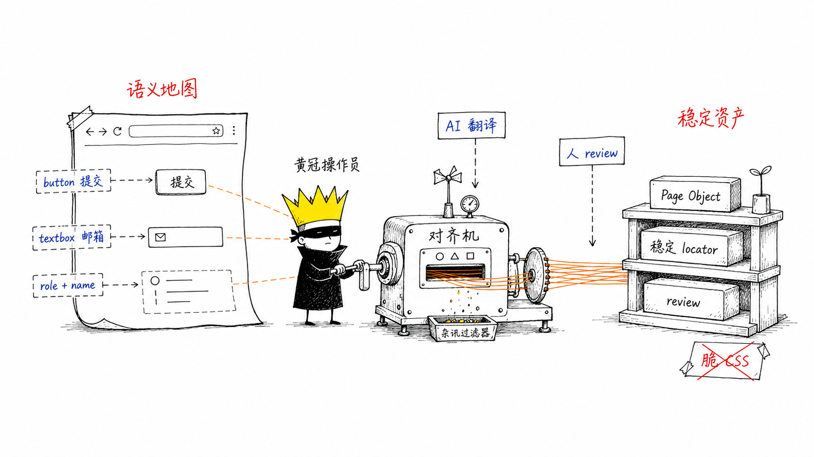
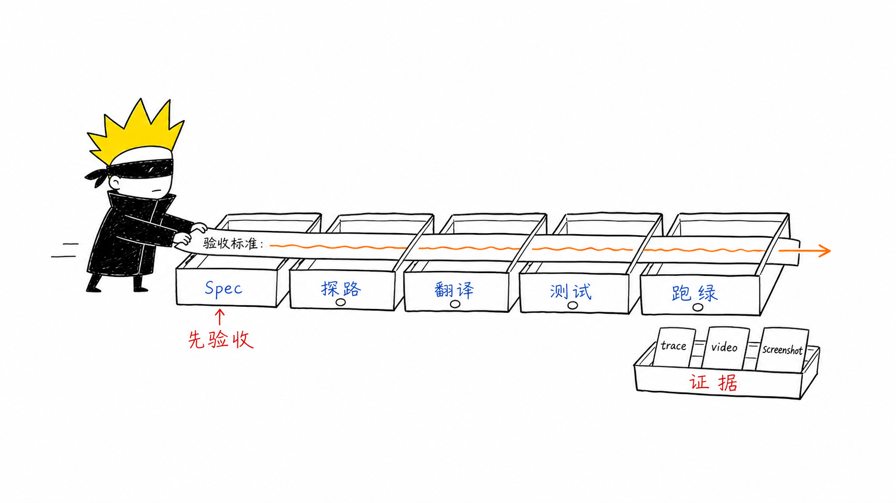
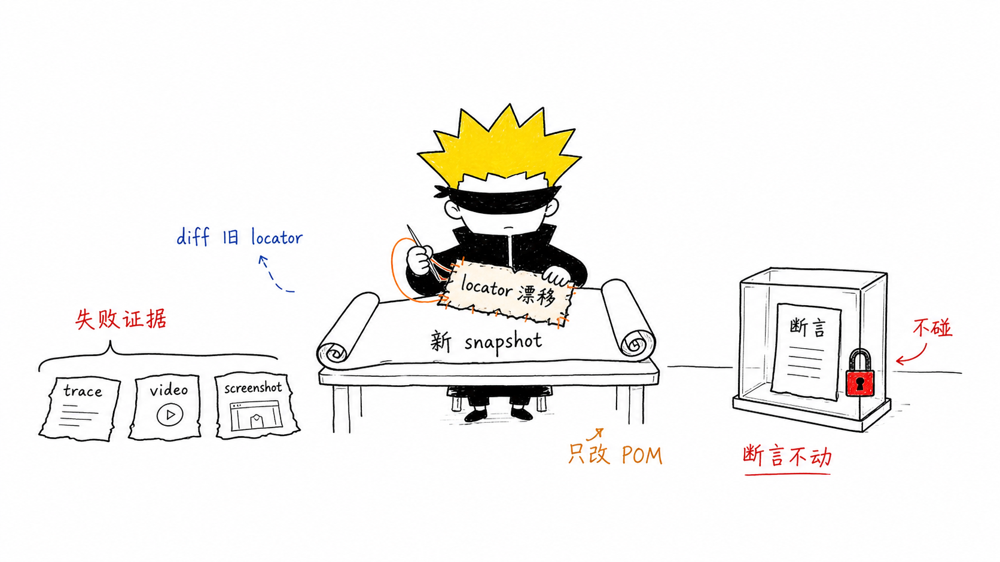

核心结论：agent-browser 负责把页面跑成一张语义地图，Python Playwright 负责把这张地图固化成稳定测试资产。

两者靠 `role + name` 衔接。中间的转换工作交给 AI，人只做验收、取舍和 review。

**何时用**：新页面、新功能，或 UI 还没完全稳定时。

**何时不用**：老页面已经有稳定 POM 时，直接改 page object，别每次重新探路。

**前提**：先写清验收标准。探路夹在 spec 和代码之间，不是测试起点。



## 五步



### 1. Spec：先写验收标准

用一句话讲清楚：打开哪个页面 → 执行什么操作 → 断言看到什么结果。

把这句话存进 `tests/.../TEST-CATALOG.md`。后面的测试断言都从这里来。

### 2. 探路：用 agent-browser 跑出语义地图

```bash
agent-browser open <url>
agent-browser snapshot              # 拿 role + name 语义地图，这是核心产出
agent-browser fill @e1 "..."        # 用临时 ref 走一遍流程，确认路径可达
agent-browser click @e4
agent-browser screenshot ui.png     # 顺手做 UX 体检，有明显问题先改 UI
agent-browser close
```

注意：snapshot 前要先触发动态内容。该滚动就滚动，该打开弹窗就打开。否则抓到的是半张地图。

### 3. 翻译：把 `role + name` 变成稳定 locator

让 AI 根据 snapshot 生成 `pages/xxx_page.py` 草稿，然后人工 review。不要手抄 locator。

| agent-browser snapshot     | Python Playwright locator                                                  |
| -------------------------- | -------------------------------------------------------------------------- |
| `button "提交"`            | `page.get_by_role("button", name="提交")`                                  |
| `textbox "邮箱"`           | `page.get_by_role("textbox", name="邮箱")`，或 `page.get_by_label("邮箱")` |
| `link "更多"`              | `page.get_by_role("link", name="更多")`                                    |
| `checkbox "记住我"`        | `page.get_by_role("checkbox", name="记住我")`                              |
| `combobox "模型"`          | `page.get_by_role("combobox", name="模型")`                                |
| `heading "标题" [level=1]` | `page.get_by_role("heading", name="标题")`                                 |
| `StaticText "xxx"`         | `page.get_by_text("xxx")`                                                  |
| `generic` / 无 name        | 优先给页面补 `data-testid`，再用 `page.get_by_test_id("...")`              |

只有在没法改页面时，才临时回退到 CSS。脆弱 CSS 不能成为默认方案。

### 4. 写测试：只调 page object，断言来自 spec

测试文件只调用 page object，再补上断言。

断言来自第 1 步的验收标准，不从 agent-browser 的操作过程里临时发挥。等待用 `expect(...)`，不要手写 `sleep`。

### 5. 跑绿：本地验证，失败留证据

```bash
python -m pytest tests/xxx.py --tracing=retain-on-failure \
  --video=retain-on-failure --screenshot=only-on-failure
```

失败时先看 trace、video、screenshot，再决定是产品问题、测试问题，还是 locator 漂移。

## 五条铁律

1. `@e1`、`@e2` 只是临时引用，绝不能进脚本。脚本只带走 `role + name`。
2. snapshot 前先触发动态内容，再抓语义地图。
3. 遇到 `generic` 或无 name 的元素，优先补 `data-testid`，不要硬挑脆弱 CSS。
4. locator 草稿让 AI 生成，人负责 review。
5. 探路按场景用。新页面探路，老页面直改，自愈时重探。

## 自愈场景



当回归测试失败，且怀疑是页面结构或可访问名称变化时，可以这样处理：

```text
测试失败
-> agent-browser 重新 snapshot，拿当前语义地图
-> AI 对比旧 locator，找出漂移点
-> 只改 page object 对应行
-> 不碰断言
```

compact snapshot 是高质量的失败现场证据。它比一大段 DOM 更短，也更贴近用户真实可见的页面结构。

这里的自愈只修 locator 漂移，不修业务断言。断言变了，先回到验收标准重新确认。

## 一句话版本

agent-browser 给语义地图，Playwright 固化测试资产；`role + name` 负责衔接，翻译交给 AI。新页面探路，老页面直改，自愈时重探，别一刀切。

## 参考

- agent-browser：Vercel Labs 的 headless 浏览器自动化 CLI，底层 Rust + Playwright，用 accessibility tree 和 `@ref` 降低 token 消耗。
- 流程原型：[我是怎样使用 AI 构建 E2E 测试体系的？](https://vikingz.me/ai-e2e/)（Viking，TS 版 `Spec → Code → Verify → Test → Green`）。
