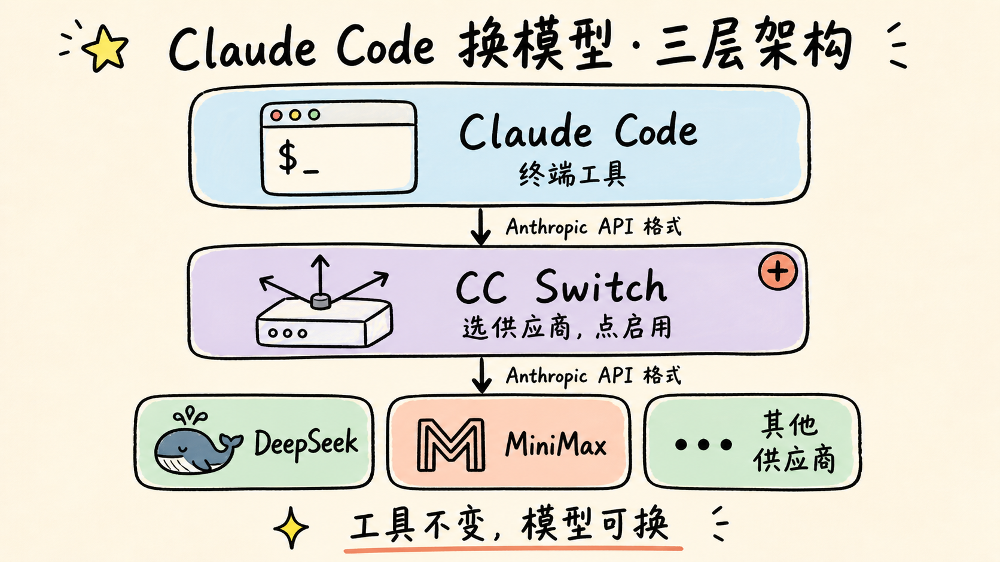
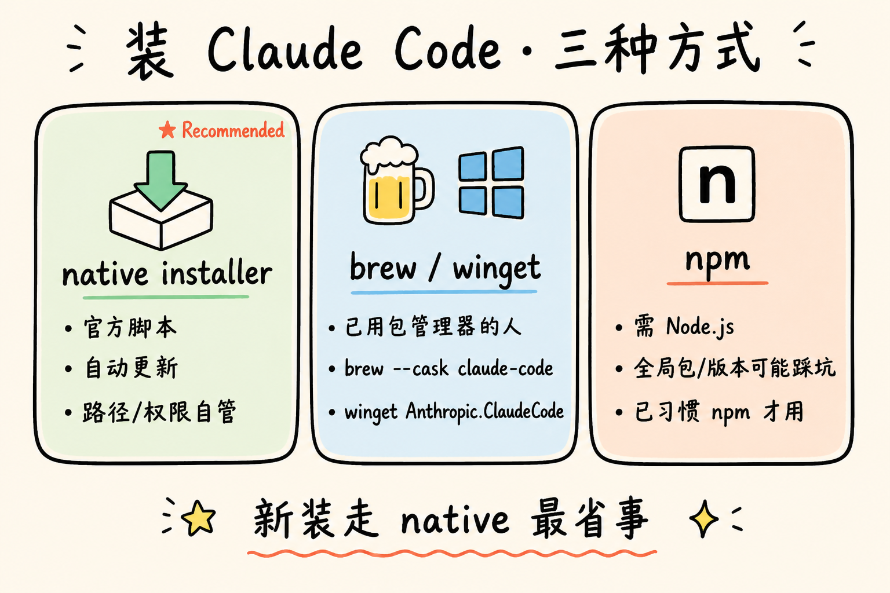
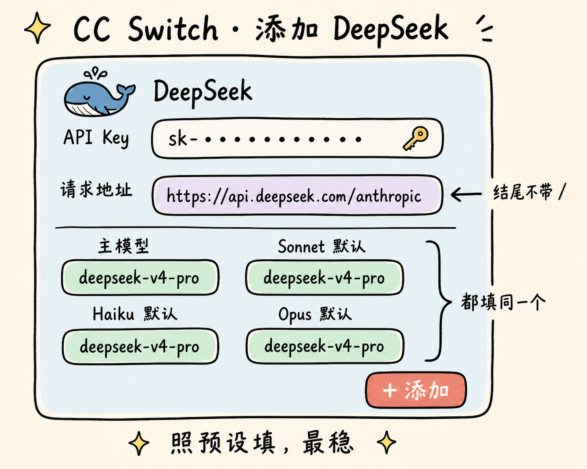
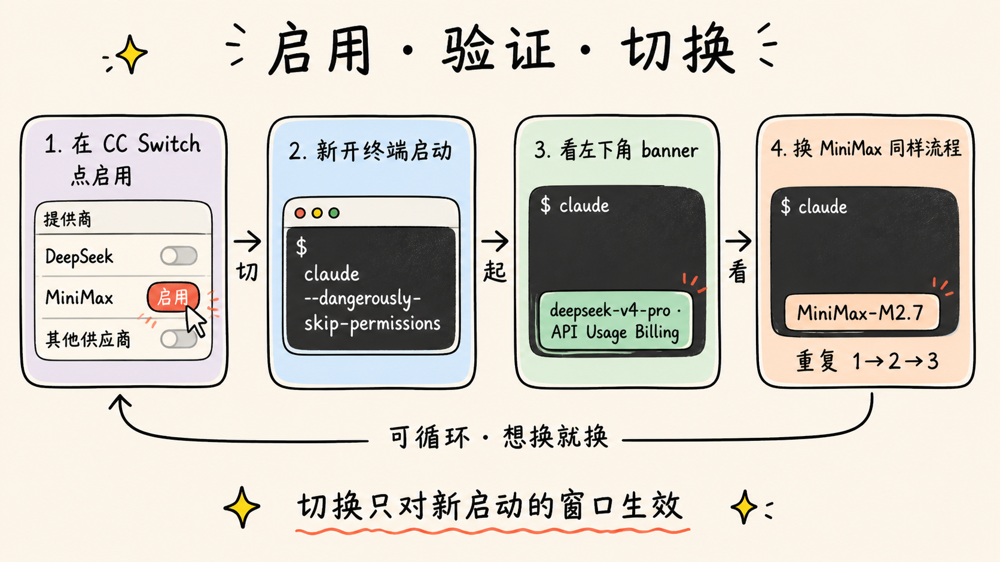
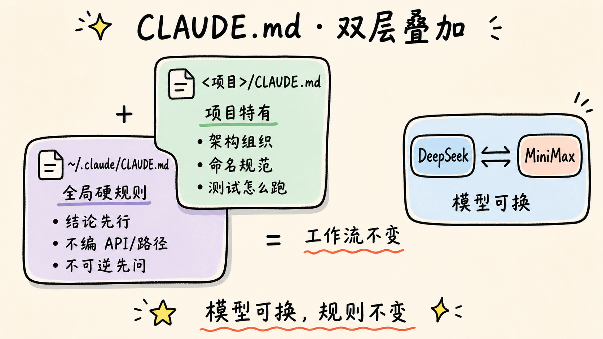

在终端运行 `claude --dangerously-skip-permissions` 启动 Claude Code，启动页左下角会显示当前调用的模型。启用 DeepSeek 时是 `deepseek-v4-pro · API Usage Billing`，切到 MiniMax 后新开的进程显示 `MiniMax-M2.7`。入口没变，模型按任务切。

Claude Code 仍按 Anthropic 协议发请求，其他厂商提供兼容接口就能接进来。以前换一次后端要改环境变量、改 `settings.json`、重启终端；CC Switch 把这套收进图形界面：选供应商，点启用。



## 装 Claude Code

新装优先走 native installer。这是官方安装脚本，路径、权限、自动更新它自己管。npm 装也能跑，但要先有 Node.js，遇到全局包冲突、Node 版本不对、权限不够时容易折腾。除非你已经习惯 npm 管版本，否则不用走这条路。

native installer 会自动更新，最省事：

```bash
# Mac / Linux / WSL
curl -fsSL https://claude.ai/install.sh | bash
```

```powershell
# Windows PowerShell
irm https://claude.ai/install.ps1 | iex
```

已经装了 Homebrew（Mac）或 WinGet（Windows）的，可以用包管理器装：

```bash
# Mac
brew install --cask claude-code
```

```powershell
# Windows
winget install Anthropic.ClaudeCode
```

npm 方式还能用：

```bash
npm install -g @anthropic-ai/claude-code
```

装完检查一下：

```bash
claude --version
claude doctor
```

`claude --version` 看版本号，`claude doctor` 看是用哪种方式装的、装到了哪里。Windows 上跑 Claude Code 要先装 Git for Windows，因为它会带上 Bash，没有 Bash 一些工具命令会调不动。



## 装 CC Switch

[CC Switch](https://github.com/farion1231/cc-switch) 是 farion1231 做的开源项目，跨平台桌面应用，用来集中管理 AI 命令行工具背后用哪家供应商。这里只讲 Claude Code 这一种用法。

Mac 用 Homebrew tap：

```bash
brew tap farion1231/ccswitch
brew install --cask cc-switch
```

Windows 去仓库 Releases 下载。`CC-Switch-v{version}-Windows.msi` 是带安装器的版本，`CC-Switch-v{version}-Windows-Portable.zip` 是免安装版，解压就能跑。

Linux 直接下载对应包：Debian / Ubuntu 选 `.deb`，Fedora / RHEL / openSUSE 选 `.rpm`，其他发行版优先试 `.AppImage`。

Mac 版目前已经做过 Apple 的签名和公证，正常情况下双击就能打开。如果系统还是弹拦截窗口，按 Releases 或 README 里的最新说明处理。

## 走通 DeepSeek

打开 CC Switch 主界面，点右上角橙色 `+` 进入添加流程。预设列表里选 DeepSeek，名称、官网、请求地址会自动填好。

唯一必须手动填的是 API Key，去 DeepSeek 官网控制台申请一个粘进来。下面的认证方式、API 格式、请求地址这些字段先别动，照预设来跑通最稳。

请求地址默认是：

```text
https://api.deepseek.com/anthropic
```

这个地址结尾不带斜杠，是 DeepSeek 留给 Anthropic 协议的入口。Claude Code 把请求按 Anthropic 的格式发到这里，DeepSeek 收到后处理，再按同样格式返回。

模型映射有四个槽位：主模型 / Sonnet 默认 / Haiku 默认 / Opus 默认。如果目标是 DeepSeek V4 Pro，把四个槽位都填成：

```text
deepseek-v4-pro
```

Claude Code 在不同场景会请求不同的 Anthropic 模型名，平时用 Sonnet，重任务可能切 Opus。四个槽位都填同一个 model id，万一某次请求没打到主模型，也不会跑到旧版本或默认版本上去。

如果以后 DeepSeek 改了模型名，以 DeepSeek API 文档里的 model id 为准，不要按网页上的展示名或营销名填。

填完右下角点 `+ 添加`。



## 启用、验证、切到 MiniMax

回到主界面，鼠标悬停在目标供应商那一行上，右侧会出现一排操作按钮。蓝色 `启用` 就是切换键。

切完后开个新终端窗口跑：

```bash
claude --dangerously-skip-permissions
```

想确认有没有切成功，最稳的方式是看终端启动栏显示的模型名，再对一下 CC Switch 里当前启用的供应商。直接问模型「你是什么模型」只能当辅助，因为模型的自我介绍会被系统提示词或路由配置影响，未必准。

DeepSeek 配通后，banner 会从默认模型变成类似：

```text
deepseek-v4-pro · API Usage Billing
```



换 MiniMax 走一样的流程：添加 MiniMax 这个供应商，填 API Key，启用，新开一个 Claude Code 窗口。MiniMax 给 Anthropic 协议留的入口地址是：

```text
https://api.minimax.io/anthropic
```

模型名可以填：

```text
MiniMax-M2.7
```

切换只对新启动的 Claude Code 生效。已经在跑的窗口还是用原来的模型，不会中途换。想彻底切干净，先退出当前的 Claude Code，再重新启动。

## 还差一份 CLAUDE.md

换模型，换的是模型本身这一层。同一段指令给 DeepSeek 和 MiniMax，回答风格、操作节奏、引用文件路径的方式、对权限的把握都可能不一样。要把这些差异压平，靠 CLAUDE.md 比换模型更管用。

CLAUDE.md 是 Claude Code 启动时会自动读进去的规则文件。我自己的全局 CLAUDE.md 放在 `~/.claude/CLAUDE.md`，里面只有几条不会变的硬规则：

```markdown
## 总原则

- 结论先行。不要客套，不要说"这是个好问题"
- 方案有明显问题直接指出，不要顺着我说
- 能合理推断就执行；只有不可逆、高成本，或涉及权限、数据、账号安全时才先问
- 不确定就说不确定，不要编 API、文件路径、行号或不存在的能力

## 动手前

- 先读项目规则文件：CLAUDE.md、README、package.json
- 先看 git status，不要覆盖我未提交的改动
- 大改动先给方案和影响范围，我确认后再实施

## 必须先确认的操作

- 删除已有文件、目录，或改写 git 历史
- 修改 .env、密钥、token、CI/CD、支付、账号相关配置
- git push，尤其是 --force
- 创建 commit，除非我明确要求
```

这几条比模型选择更重要。不准编路径、动手前看 git status、不可逆操作必须先问，这些规则写死之后，模型怎么换都按同一套约束跑。

`~/.claude/CLAUDE.md` 是全局文件，对你机器上所有项目都生效。具体项目的根目录里再放一份 `CLAUDE.md`，写这个项目特有的规则，比如架构怎么组织、变量怎么命名、测试怎么跑。两层叠加之后，模型可以换，工作流不用重学。



## 收尾

Claude Code 提供工具入口，CC Switch 决定调用哪家模型，CLAUDE.md 把协作规则写死。以后新模型出来，要改的就是供应商配置和 model id 两个字段，模型本身已经是可以随时替换的零件。
