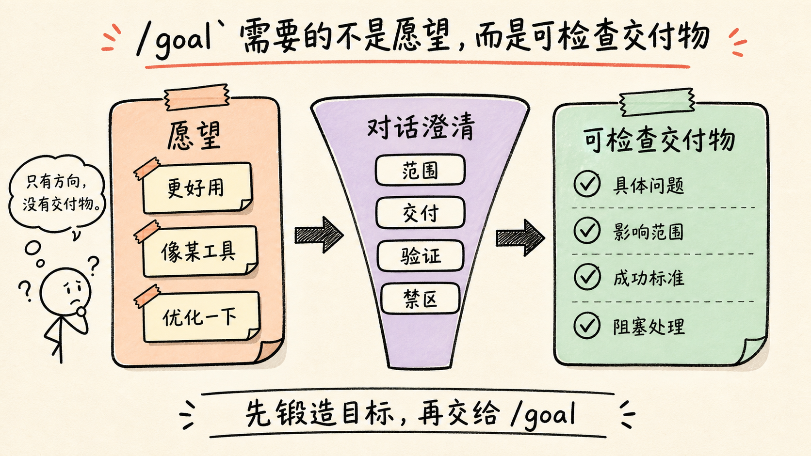
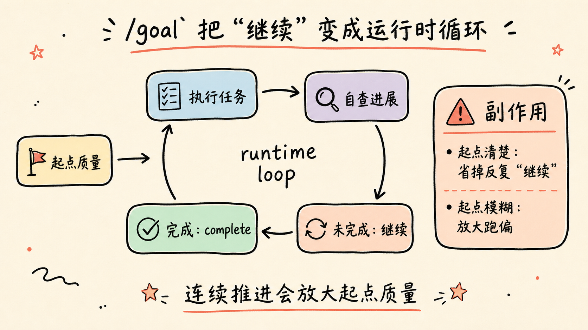
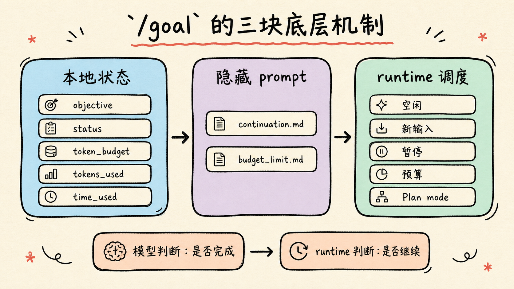
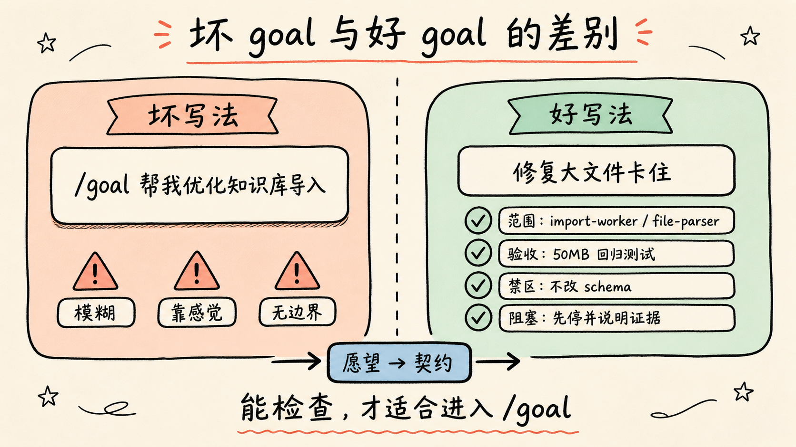
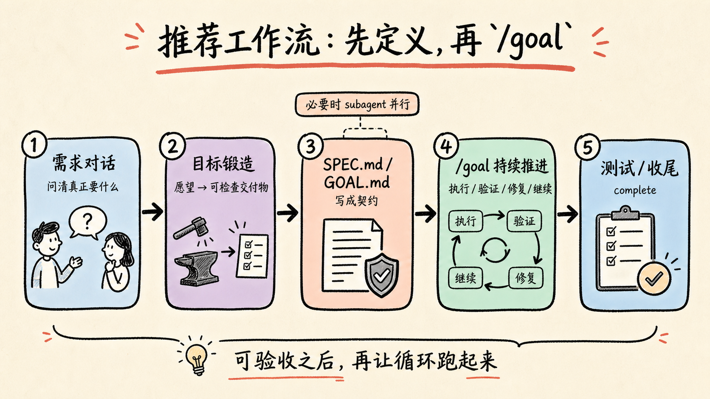

`/goal` 的核心变化，不是多了一个命令，而是 Codex 可以把一个长期目标挂到当前线程上，然后一轮轮自动推进，直到完成、暂停、被打断，或者达到预算上限。

我体验下来，感觉这个方向是对的：很多时候你只要下达一个相对完整的任务，Codex 就能自己写代码、跑测试、修错误、继续下一轮。

但这里有一个关键前提：目标必须一开始就写得足够清楚。

如果最开始的提示词含糊，`/goal` 并不会自动替你完成需求澄清。它更像是一个持续执行器，不是一个需求设计器。所以我不认为它适合直接承担最开始的任务下发和需求定义。更合理的用法，是先完成澄清、拆解、验收标准定义，再把一个可执行、可验证的目标挂到 `/goal` 上。

更准确地说，`/goal` 需要的不是愿望，而是可检查的交付物。

很多人以为自己有目标，其实只有一个大概方向。比如“把我的知识库导入体验优化一下”“做成某个工具那样”“让这个项目更好用”。这些都不是 goal，只是愿望。它们还需要通过对话继续拆：到底改哪段流程、交付什么文件、验证什么测试、哪些地方不能碰。

目标应该长这样：修复一个具体问题，限制影响范围，写清楚成功标准，并说明遇到阻塞时怎么停。只有到这一步，`/goal` 才适合接手。



## `/goal` 解决什么问题

以前让 AI 持续写代码、跑测试、修错误，通常有两种办法。

一种是人手动反复输入“继续”。

另一种是靠外部脚本，把模型调用、命令执行、错误修复、循环判断包起来。

`/goal` 把这件事放进了 Codex 运行时里。

它的基本流程是：

```text
AI 执行任务
每轮结束后检查进展
如果目标没完成，就继续下一轮
完成后标记 goal complete
```

也就是说，`/goal` 解决的是任务推进的连续性。

这类模式在社区里经常被称为 Ralph loop：模型执行一轮，观察结果，再决定是否继续。现在 Codex 把它产品化了，变成一个内置能力。

但连续推进有一个副作用：它会放大起点的质量。

如果起点是清楚的，它会节省大量“继续、再跑、继续修”的手动操作。

如果起点是模糊的，它也会很勤奋，只是勤奋地朝错误方向推进。



## 底层机制大概分三块

第一块是本地状态。

Codex 会把 goal 存到当前线程状态里，记录目标、状态和预算信息，例如：

```text
objective
status
token_budget
tokens_used
time_used
```

状态包括：

```text
active
paused
budget_limited
complete
```

第二块是隐藏 prompt。

关键模板主要有两个：

```text
goals/continuation.md
goals/budget_limit.md
```

当 runtime 判断任务还可以继续时，会注入 continuation prompt，让模型继续推进当前目标，并检查是否已经完成。

当 token budget 到上限时，会注入 budget limit prompt，让模型收尾，说明已经完成了什么、还剩什么、为什么停下来。

第三块是 runtime 调度。

“是否继续”不是单纯由模型决定，也不是单纯由命令决定，而是 runtime 和模型共同完成。

模型负责判断目标是否完成，并在完成时调用 `update_goal` 标记 complete。

runtime 负责检查当前线程是否空闲、是否有新用户输入、是否暂停、是否达到预算、是否处于 Plan mode，然后决定要不要开启下一轮。

所以 `/goal` 的本质不是一个普通命令，而是一套目标状态、隐藏提示词和自动调度组成的循环机制。



## 怎么用

启用后，可以这样使用：

```bash
codex --enable goals
/goal 写完这个功能并跑通测试
/goal pause
/goal resume
/goal clear
```

但这里最容易踩坑的地方，正是这个示例：

```text
/goal 写完这个功能并跑通测试
```

这个写法太粗了。

它适合演示命令存在，但不适合真实使用。因为“这个功能”是什么、范围在哪里、成功标准是什么、遇到阻塞怎么办，都没有定义清楚。

更推荐的写法是：

```text
/goal 完成 <目标>。范围是 <文件/模块>。成功标准是 <测试/构建/验收条件>。如果遇到阻塞，先尝试解决；无法解决时总结阻塞点并停止。
```

例如：

```text
/goal 修复 Markdown 批量导入时标题丢失的问题。范围是 importer、parser 和相关测试。成功标准是新增回归测试，并确保 pnpm test importer 通过。如果遇到无法判断的格式规则，先总结歧义并停止。
```

这个写法比“写完这个功能”强很多。

因为它同时定义了四件事：

```text
要做什么
不要碰哪里
怎样算完成
遇到阻塞怎么处理
```

这才是适合 `/goal` 的目标。

一个更严格的判断标准是：这个 goal 能不能被检查。

如果目标完成后只能靠感觉判断，比如“更好用”“更像某个产品”“体验高级一点”，它就还不是一个合格 goal。

如果目标完成后可以检查交付物，比如“新增一个测试文件”“生成一份 `SPEC.md`”“修复某个命令的报错”“构建和测试通过”，它才适合进入 `/goal`。

社区里已经有人做类似 `goal-forge` 的 skill，思路就是把一个粗糙的 coding idea 先变成 `SPEC.md`、`GOAL.md` 和 `/goal` 可执行的契约。这个方向是对的：`/goal` 前面需要一个“目标锻造”阶段，把模糊愿望压成可执行规格。



## `/goal` 不适合替代需求澄清

我最疑惑的一点是，目前这个模式似乎没有一个明确的先澄清需求阶段。

这会带来一个问题：如果用户一开始给的目标不够清楚，Codex 可能不会先停下来问，而是直接进入执行循环。

这在长期任务里风险更大。

单轮任务跑偏，最多是一轮错。

`/goal` 跑偏，是连续多轮朝着错误方向推进。

所以它越能自动执行，越要求开始时的目标更具体。

这也是我觉得它可以学 Claude design 功能的原因：在进入执行之前，先有一个需求设计阶段，把目标、范围、约束、验收标准说清楚。等任务已经足够明确，再交给 `/goal` 持续推进。

换句话说，`/goal` 适合放在需求定义之后，而不是代替需求定义本身。

## 适合和不适合的场景

按这个标准看，`/goal` 目前更适合几类任务。

第一类是重构和补测试。目标清楚，验证方式也清楚，比如改完某个模块后跑指定测试。

第二类是 MVP。只要范围收得住，`/goal` 可以持续推进从文件创建、功能实现到基础验证的过程。

第三类是逆向和梳理。比如分析一个项目的结构、找出数据流、整理一份技术说明。它的交付物可以是文档、图表或清单。

第四类是 deep research / auto research。前提是你把研究问题、输出格式和停止条件写清楚。

它不太适合两类任务。

第一类是“写一个好看的前端”。好看本身很难自动验收，如果没有设计稿、视觉约束、截图验收或明确组件范围，`/goal` 很容易反复改表面。

第二类是“写文案”。文案质量高度依赖语气、受众和传播目标，如果没有明确风格样本和判断标准，持续推进不一定会变好，可能只是变长。

所以不是所有长任务都适合 `/goal`。它适合有交付物、有边界、有检查方式的任务。

## 更合理的工作流

我会把 `/goal` 放在这个位置：

```text
先沟通需求
-> 把愿望压成可检查的交付物
-> 拆出目标、范围、验收标准
-> 必要时生成 SPEC.md / GOAL.md
-> 必要时让 subagent 并行调研或实现
-> 再用 /goal 挂一个长期、可验收的目标
-> Codex 自动推进、验证、收尾
```

这样它的价值最大。

如果一开始就写：

```text
/goal 帮我优化知识库导入
```

大概率会跑偏。

但如果写成：

```text
/goal 修复知识库导入任务在大文件场景下卡住的问题。范围只包括 import-worker、file-parser 和相关测试。成功标准是新增 50MB Markdown 文件的回归测试，并确保 pnpm test import-worker 通过。不要改数据库 schema；如果发现瓶颈来自存储层，先停止并说明证据。
```

这就清楚很多。

Codex 知道边界在哪里，也知道什么时候该停。



## 总结

`/goal` 让 Codex 从单轮命令执行，向长期本地代理迈了一步。

它把长期目标挂到线程状态里，由 runtime 控制循环，用隐藏 prompt 推动下一轮，再由模型判断是否完成并标记 complete。

但它的边界也很清楚：

`/goal` 解决的是持续推进，不是需求澄清。

它适合执行一个已经定义清楚、可以验收的长期目标，不适合直接替代任务设计、需求拆解和 subagent 调度。

所以真正推荐的用法不是把一句模糊需求扔给 `/goal`，而是先把任务写成一个可执行规格，再让 `/goal` 负责把它做完。
