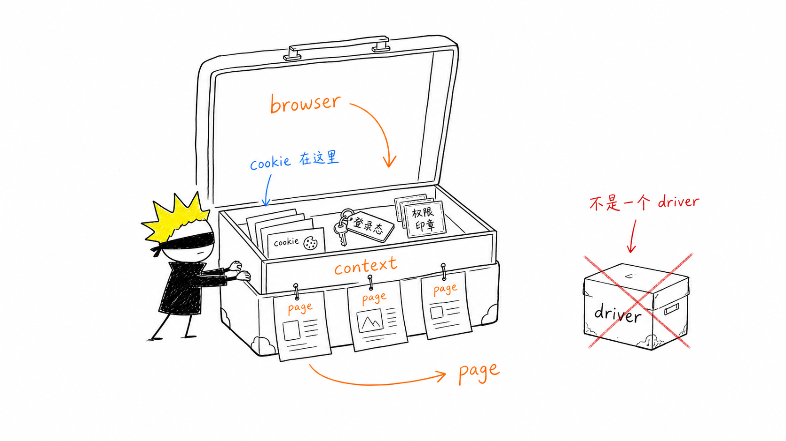
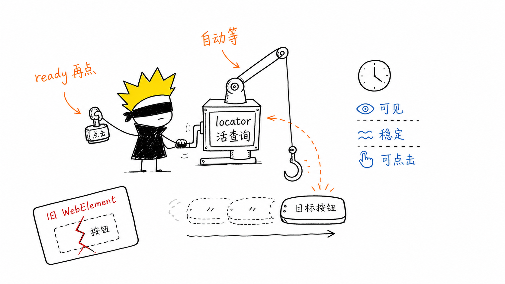
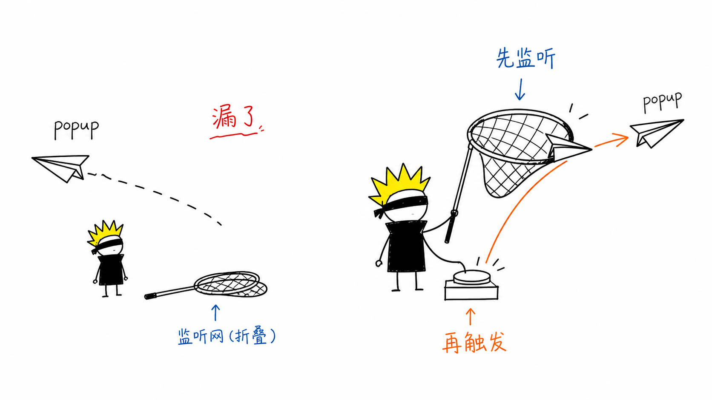

你已经会 Python + Selenium，迁移 Playwright 不用从自动化测试基础重学，真正要换的是操作思路：Selenium 是先找到元素、再自己动手，Playwright 是先声明定位器、把时机交给框架。这条想明白，后面那些差异都是它的展开；想不明白，写出来的还是个换了语法的 Selenium。



## 1. 驱动模型：`driver` vs `browser/context/page`

Selenium 写法：

```python
from selenium import webdriver

driver = webdriver.Chrome()
driver.get("https://example.com")
```

Playwright 写法：

```python
from playwright.sync_api import sync_playwright

with sync_playwright() as p:
    browser = p.chromium.launch()
    context = browser.new_context()
    page = context.new_page()
    page.goto("https://example.com")
```

常见坑：Selenium 里一个 `driver` 基本就代表整个浏览器会话，Playwright 要分清 `browser`、`context`、`page` 三层。登录态、cookie、权限隔离主要在 `context` 层，不在 `page` 层。

## 2. 元素查找：`WebElement` vs `Locator`

Selenium 写法：

```python
button = driver.find_element(By.CSS_SELECTOR, "button.submit")
button.click()
```

Playwright 写法：

```python
page.locator("button.submit").click()
```

常见坑：`locator()` 不会立即取元素，它更像一条查询描述，等到真正操作时才解析，并自动等待。别把它当成 Selenium 的 `WebElement` 缓存。

## 3. 等待机制：显式等待少了很多

Selenium 写法：

```python
from selenium.webdriver.support.ui import WebDriverWait
from selenium.webdriver.support import expected_conditions as EC

WebDriverWait(driver, 10).until(
    EC.element_to_be_clickable((By.CSS_SELECTOR, "button.submit"))
).click()
```

Playwright 写法：

```python
page.locator("button.submit").click()
```

常见坑：Playwright 的点击、填写、断言都带自动等待。迁移时别照搬大量 `sleep()` / `wait_for_timeout()`，那样脚本会变慢，而且照样不稳。



## 4. 推荐选择器不同：CSS/XPath vs 用户语义定位

Selenium 写法：

```python
driver.find_element(By.CSS_SELECTOR, "input[name='email']").send_keys("a@b.com")
```

Playwright 写法：

```python
page.get_by_label("Email").fill("a@b.com")
```

常见坑：Playwright 更推荐 `get_by_role()`、`get_by_label()`、`get_by_text()`、`get_by_test_id()`。继续只用 XPath/CSS 也能跑，但会失去 Playwright 在可读性和稳定性上的优势。

## 5. 严格匹配：多个元素会直接报错

Selenium 写法：

```python
driver.find_element(By.CSS_SELECTOR, ".item").click()
```

Playwright 写法：

```python
page.locator(".item").click()
```

常见坑：如果 `.item` 匹配到多个元素，Playwright 会报 strict mode violation。得明确选哪个：

```python
page.locator(".item").first.click()
page.locator(".item").nth(2).click()
page.get_by_role("button", name="Delete").click()
```

## 6. 输入：`send_keys` vs `fill` / `press`

Selenium 写法：

```python
driver.find_element(By.NAME, "q").send_keys("playwright")
driver.find_element(By.NAME, "q").send_keys(Keys.ENTER)
```

Playwright 写法：

```python
page.locator("[name='q']").fill("playwright")
page.locator("[name='q']").press("Enter")
```

常见坑：`fill()` 会先清空再输入，适合给表单赋值。要模拟逐字输入就用 `type()`：

```python
page.locator("[name='q']").type("playwright")
```

## 7. 断言方式：不要手写轮询

Selenium 写法：

```python
WebDriverWait(driver, 10).until(
    EC.text_to_be_present_in_element((By.CSS_SELECTOR, ".status"), "Done")
)
```

Playwright 写法：

```python
from playwright.sync_api import expect

expect(page.locator(".status")).to_have_text("Done")
```

常见坑：`expect()` 会自动等待，别写成：

```python
assert page.locator(".status").inner_text() == "Done"
```

普通 `assert` 取一次值就比较，不会像 `expect()` 那样等状态变成 Done。

## 8. 新页面 / 弹窗：先监听，再触发

Selenium 写法：

```python
old = driver.current_window_handle
driver.find_element(By.LINK_TEXT, "Open").click()

for handle in driver.window_handles:
    if handle != old:
        driver.switch_to.window(handle)
        break
```

Playwright 写法：

```python
with page.expect_popup() as popup_info:
    page.get_by_text("Open").click()

popup = popup_info.value
popup.wait_for_load_state()
```

常见坑：要先注册 `expect_popup()`，再点击触发。顺序反了就可能漏掉事件。



## 9. iframe：`switch_to.frame` vs `frame_locator`

Selenium 写法：

```python
driver.switch_to.frame(driver.find_element(By.CSS_SELECTOR, "iframe.payment"))
driver.find_element(By.NAME, "card").send_keys("4242424242424242")
driver.switch_to.default_content()
```

Playwright 写法：

```python
page.frame_locator("iframe.payment").locator("[name='card']").fill("4242424242424242")
```

常见坑：Playwright 一般不用手动切 frame。别再找 `switch_to`，直接用 `frame_locator()` 链式定位。

## 10. 网络能力：Playwright 内置更强

Selenium 写法：

```python
driver.get("https://example.com")
# Selenium 原生不擅长拦截或 mock 网络
```

Playwright 写法：

```python
page.route("**/api/user", lambda route: route.fulfill(
    json={"name": "Kerwin"}
))
page.goto("https://example.com")
```

常见坑：`route()` 要在请求发生前注册。页面都加载完了再 route，已经发出的请求就拦不到了。

## 11. 异步模型：Python 有 sync 和 async 两套 API

同步 Playwright：

```python
from playwright.sync_api import sync_playwright
```

异步 Playwright：

```python
from playwright.async_api import async_playwright
```

常见坑：不要混用 sync / async 两套 API。项目本身是异步的，比如 FastAPI 或 asyncio 脚本，就用 async API；普通脚本、从 Selenium 迁过来的脚本，用 sync API 更顺手。

## 12. 迁移速查

```text
find_element      -> locator / get_by_role / get_by_label
send_keys         -> fill / type / press
WebDriverWait     -> locator action / expect
switch_to.frame   -> frame_locator
window_handles    -> expect_popup
driver session    -> browser + context + page
```

最大的坑：别把 Playwright 写成带自动等待的 Selenium。真正的迁移会顺手把老 Selenium 里的 `sleep`、脆弱 XPath、手写等待和窗口切换逻辑都改掉。
