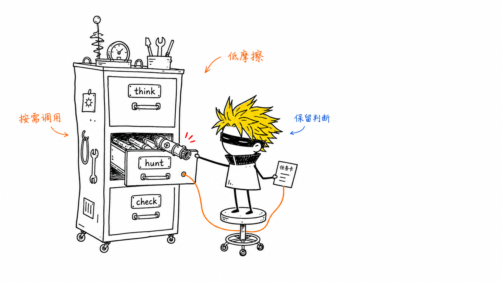
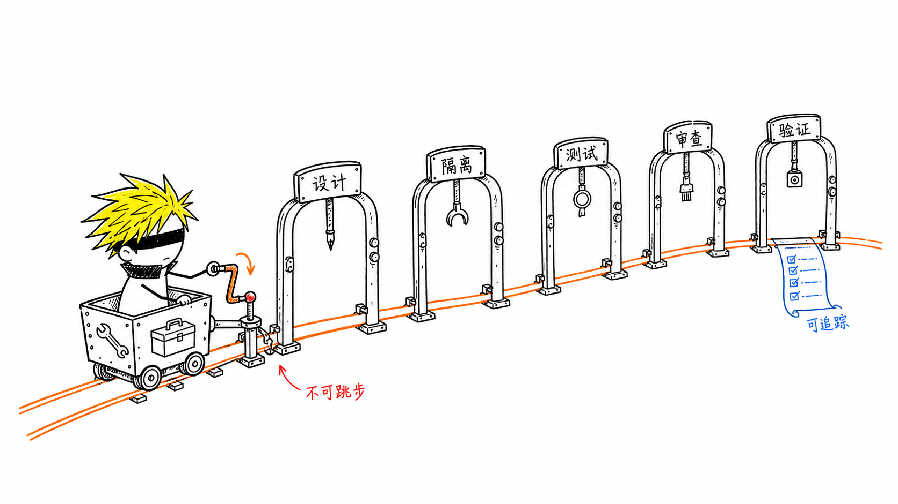
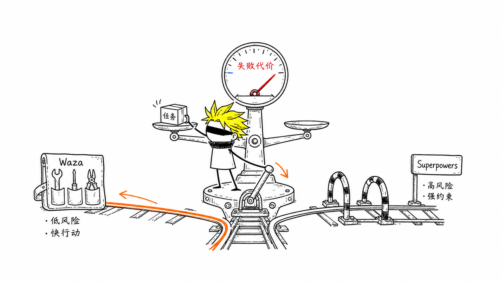

AI 写代码越来越快，真正拉开差距的，已经不是生成能力，而是它能否在动手前想清楚、出错后找到根因、完成后拿出验证证据。

[Waza](https://github.com/tw93/Waza) 和 [Superpowers](https://github.com/obra/superpowers) 都在训练这些工程习惯，但路线截然不同：

- Waza 提供一套按需调用的技能。
- Superpowers 提供一条难以跳过的开发流程。

我的选择是：

> 日常开发用 Waza，复杂、高风险任务用 Superpowers。

判断依据也很简单：**一次失误的代价，是否值得支付完整流程的成本。**

## Waza：在关键节点约束 Agent

Waza 将常见工程活动拆成八个独立技能，覆盖方案设计、界面设计、排障、审查、阅读、研究、写作和 Agent 配置审计。

它更像一个工程工具箱。

开发新功能，可以先用 `think` 明确方案，完成后用 `check` 审查和验证；遇到 Bug，则由 `hunt` 先查根因，再进入修复。

技能可以串联，但不会自动把每个任务塞进同一条流水线。

因此，修改一个配置时，Agent 不必先写设计文档、创建 worktree、拆解实施计划，再启动多轮审查。任务简单，流程就短；风险增加，再补上对应的技能。

这种设计保留了模型的判断空间，也降低了日常使用的摩擦。

代价同样来自这里：如果 Agent 选错技能、遗漏调用，工程流程就可能缺一环。Waza 的效果更依赖模型能力、项目规则和使用者判断。



## Superpowers：用流程压缩犯错空间

Superpowers 管得更深。

它覆盖从需求讨论到分支收尾的完整开发周期：

```text
需求讨论
→ 设计确认
→ 隔离工作区
→ 实施计划
→ 测试驱动开发
→ 子 Agent 执行
→ 代码审查
→ 完成验证
```

功能开发前先明确设计，实现阶段强调测试先行，任务完成后还可能经过需求符合性和代码质量两轮审查。

它更像一套嵌入 Agent 的软件工程制度。

这套制度适合跨模块功能、核心逻辑修改、多 Agent 协作，以及回归成本较高的长期项目。固定流程减少了 Agent 临场发挥的空间，也让需求、实现和验证更容易追踪。

稳定性并非免费。

更多步骤意味着更多上下文、调用次数和等待时间。面对单文件修改、探索性原型或缺少测试的项目，完整流程很容易压过任务本身。



## 两者真正的差异

| 维度       | Waza                       | Superpowers            |
| ---------- | -------------------------- | ---------------------- |
| 形态       | 工程技能工具箱             | 完整开发方法论         |
| 调用方式   | 按需组合                   | 流程串联               |
| 模型自主性 | 较高                       | 较低                   |
| 执行成本   | 较低                       | 较高                   |
| 适合任务   | 日常开发、排障、研究与写作 | 复杂、高风险的软件工程 |
| 主要风险   | 遗漏关键步骤               | 流程负担过重           |

Waza 把目标和边界交代清楚，然后让模型发挥。

Superpowers 预先规定关键动作，用流程减少模型犯错的机会。

一个优化灵活性，一个优化确定性。

## 不要在同一个任务里重复叠加

两者可以同时安装，但不建议同时接管一个任务。

它们有不少重叠能力：

- Waza 的 `think` 对应 Superpowers 的设计与计划流程。
- `hunt` 对应系统化排障。
- `check` 对应代码审查和完成前验证。

如果两套路由同时生效，一个普通需求可能经历两轮方案确认、两套审查和重复验证。质量未必提高，执行成本一定会上升。

更合理的方式，是根据风险切换工作模式：

```text
日常任务：Waza
高风险工程：Superpowers
```

## 我的使用建议

个人开发者、小团队和 AI 自动化项目，可以把 Waza 设为默认工作流：

```text
新功能：think → implement → check
Bug：hunt → fix → check
研究写作：read → learn → write
```

当任务开始跨越多个模块，涉及核心数据，或者一次回归会带来明显损失，再让 Superpowers 接管完整流程。

选择这类工具时，技能数量并不重要。真正值得问的是：

> 这次任务失败后，我要付出多大代价？



失败成本低，让 Agent 快速行动。

失败成本高，就用流程收紧它的活动范围。

**Waza 提高日常开发的流动性，Superpowers 提高复杂工程的确定性。成熟的 AI 工作流，不会固定站在其中一边，而会根据风险选择约束强度。**
